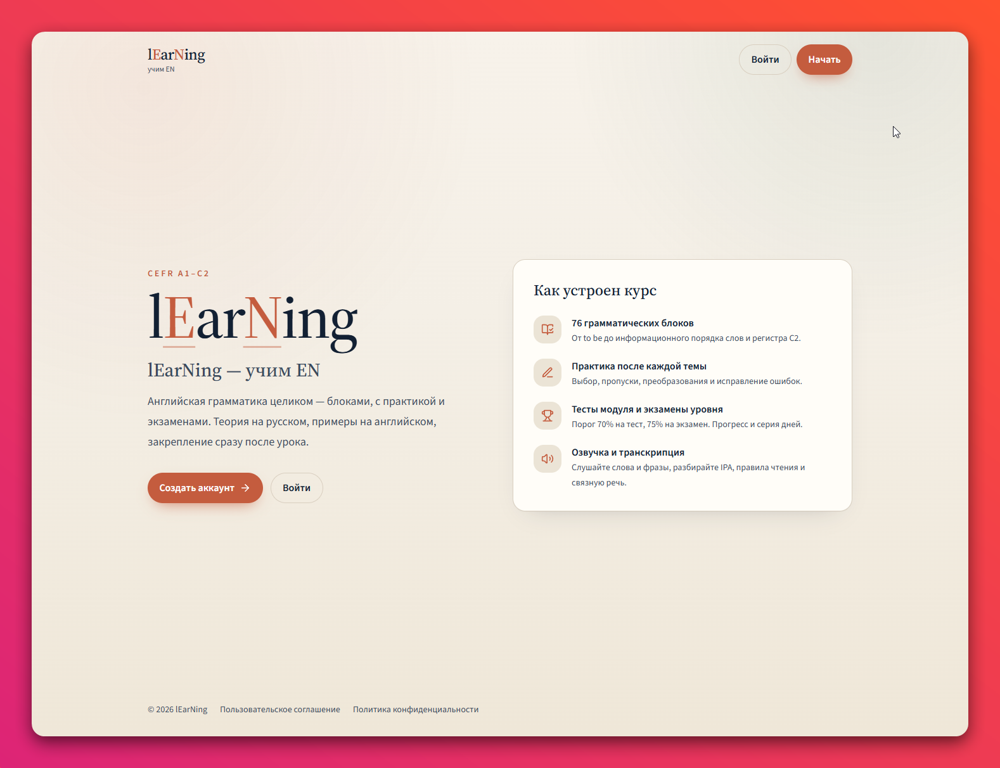

<div align="center">


<p><strong>learning EN</strong> · грамматика, словарь и звуки по CEFR A1–C2</p>



</div>

<br />

Курс английского в браузере: теория на русском, примеры на английском, практика сразу после урока. Заглавные **E** и **N** в названии — это **EN**.

Тематическая карта опирается на открытые структуры [CEFR](https://www.coe.int/en/web/common-european-framework-reference-languages) / Cambridge English, British Council LearnEnglish, Oxford Practice Grammar и English Grammar in Use. Тексты уроков — свои, не копирайт учебников.

## Что внутри

| | |
| --- | --- |
| Грамматика | 76 модулей A1–C2: урок → практика → тест |
| Экзамены | 6 уровней, проходной балл 75% |
| Словарь | десятки тем, партии по ~10 слов, разные упражнения |
| Звуки | IPA, постановка, UK/US и темп озвучки |
| Кабинет | прогресс, XP, серия дней |
| Админка | пользователи, модули, словарь, экзамены, чаевые |

Озвучка читает только английские слова (без транскрипции). Акцент и скорость общие для грамматики, словаря и звуков.

## Стек

**Python 3.12** · FastAPI · SQLAlchemy · **PostgreSQL 16** · **React 19** · TypeScript · Vite · Tailwind CSS 4 · Docker Compose

## Запуск

```bash
cp .env.example .env          # задайте SECRET_KEY и пароль БД
docker compose up --build -d
```

Сайт: [http://localhost:3000](http://localhost:3000)  
API: [http://localhost:8000/docs](http://localhost:8000/docs)

На сервере перед nginx порты 3000 / 8000 / 5432 слушают только `127.0.0.1`. Снаружи — 80 (и 443, когда появится сертификат).

### Админ

Первый администратор создаётся при сиде, если в `.env` заданы **оба** поля:

```env
ADMIN_EMAIL=you@example.com
ADMIN_PASSWORD=сложный-пароль
```

Если переменные пустые — админа нет. Уже существующего пользователя можно повысить:

```bash
docker compose exec postgres psql -U lumina -d lumina -c "UPDATE users SET role = 'admin' WHERE email = 'you@example.com';"
```

Демо-аккаунтов нет. Регистрация — с подтверждением почты (SMTP в `.env`; без SMTP ссылка пишется в лог backend).

### Данные PostgreSQL

Файлы БД — в `./data/postgres` на диске машины (на сервере рядом с репозиторием). Каталог в `.gitignore`.

- `docker compose down` данные **не** стирает
- `docker compose down -v` bind mount тоже **не** удаляет — папку нужно стирать вручную
- бэкап: скопировать `data/postgres` (лучше при остановленном `postgres`)

Повторный запуск сидер идемпотентен: уроки, экзамены и словарь дописываются, не затираются. Фонетика отдаётся из кода, не из таблиц.

## Без Docker

1. Поднимите PostgreSQL и задайте `DATABASE_URL`.
2. `cd backend && pip install -r requirements.txt && python -m app.seed.runner && uvicorn app.main:app --reload`
3. `cd frontend && npm install && npm run dev`

## Лицензия

Учебный проект. Контент курса — оригинальный. Карта тем — по открытым CEFR-структурам, не по текстам коммерческих учебников.
